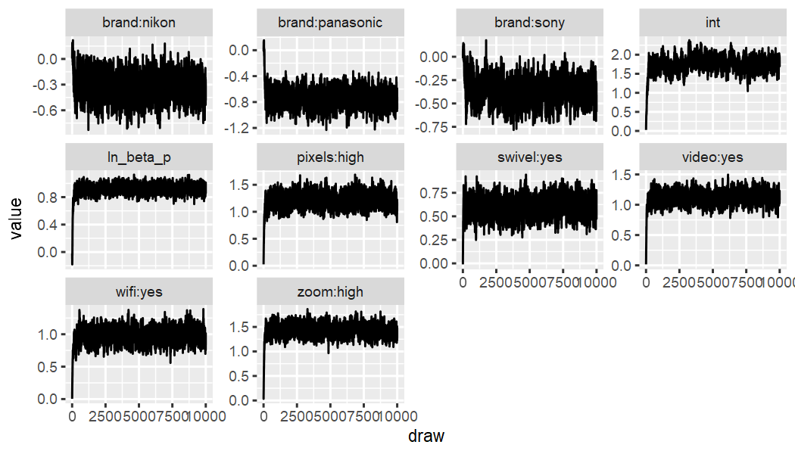
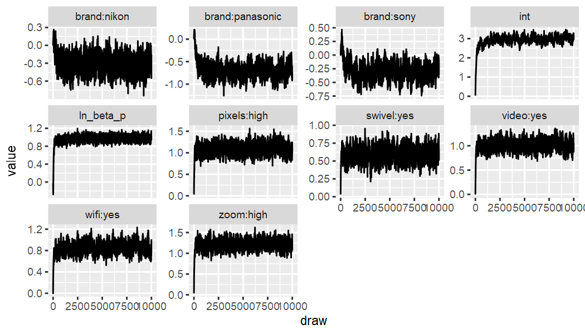
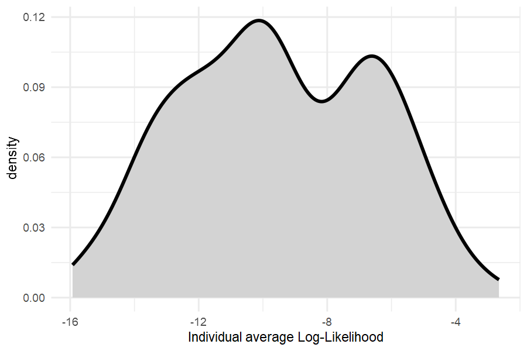

## Background

Many users have organized their choice data in a list-of-lists format, where a `list` of length "number of respondents" is created, and each element of that lists contains another list with design matrix and choice information. An example of this is the `camera` dataset in 'bayesm'. echoice2 contains some helper functions that make it easy to import such data, and estimate corresponding discrete choice models.

## Installation

The `echoice2` package is available from [CRAN](https://CRAN.R-project.org/package=echoice2) and [GitHub](https://github.com/ninohardt/echoice2).

To install from CRAN, run:


```r
  install.packages("echoice2")
```

To install the latest development version from GitHub run:


```r
  remotes::install_github("ninohardt/echoice2")
```


## Getting started

Load the package.


```r
  library(echoice2)
```

Key functions for using the package are:

-   `vd_est_vdm`: Estimating the "standard" volumetric demand model
-   `vd_est_vdm_screen`: Estimating volumetric demand model with screening
-   `vd_dem_vdm`: Demend predictions for the "standard" volumetric demand model
-   `vd_dem_vdm_screen`: Demend predictions for the volumetric demand model with screening

Functions that relate to discrete demand start in `dd_`, while functions for volumetric demand start in `vd_`. Estimation functions continue in `est`, demand simulators in `dem`. Universal functions (discrete and volumetric choice) start in `ec_`.


## Data organization

Choice data should be provided in a 'long' format tibble or data.frame, i.e. one row per alternative, choice task and respondent.

It should contain the following columns

-   `id` (integer; respondent identifier)
-   `task` (integer; task number)
-   `alt` (integer; alternative #no within task)
-   `x` (double; quantity purchased)
-   `p` (double; price)
-   attributes defining the choice alternatives (factor, ordered) and/or
-   continuous attributes defining the choice alternatives (numeric)

By default, it is assumed that respondents were able to choose the 'outside good', i.e. there is a 'no-choice' option. The no-choice option should *not* be **explicitly** stated, i.e. there is no "no-choice-level" in any of the attributes. This differs common practice in *discrete* choice modeling, however, the **implicit** outside good is consistent with both *volumetric* and *discrete* choice models based on economic assumptions.

Dummy-coding is performed automatically to ensure consistency between estimation and prediction, and to set up screening models in a consistent manner. Categorical attributes should therefore be provided as `factor` or `ordered`, and not be dummy-coded.


## Importing list-of-list data

Let's consider the camera example dataset from bayesm.


```r
  library(bayesm)
  data(camera)
  head(camera[[1]]$X)
#>   canon sony nikon panasonic pixels zoom video swivel wifi price
#> 1     0    0     1         0      0    1     0      1    0  0.79
#> 2     1    0     0         0      1    1     0      1    1  2.29
#> 3     0    0     0         1      0    0     0      0    1  1.29
#> 4     0    1     0         0      0    1     0      1    0  2.79
#> 5     0    0     0         0      0    0     0      0    0  0.00
#> 6     0    0     0         1      1    0     0      1    0  2.79
  head(camera[[1]]$y)
#> [1] 1 2 2 4 2 2
```

Now let's prepare this dataset for analysis with 'echoice2'. 
Using `ec_lol_tidy1` we can stack information from all respondents.
The `price` variable is renamed to `p`.


```r
  data_tidier <- ec_lol_tidy1(camera) %>% rename(`p`='price')
  data_tidier %>% head
#> # A tibble: 6 × 14
#>   id     task   alt canon  sony nikon panasonic pixels  zoom video swivel  wifi     p     x
#>   <chr> <int> <int> <dbl> <dbl> <dbl>     <dbl>  <dbl> <dbl> <dbl>  <dbl> <dbl> <dbl> <dbl>
#> 1 1         1     1     0     0     1         0      0     1     0      1     0  0.79     1
#> 2 1         1     2     1     0     0         0      1     1     0      1     1  2.29     0
#> 3 1         1     3     0     0     0         1      0     0     0      0     1  1.29     0
#> 4 1         1     4     0     1     0         0      0     1     0      1     0  2.79     0
#> 5 1         1     5     0     0     0         0      0     0     0      0     0  0        0
#> 6 1         2     1     0     0     0         1      1     0     0      1     0  2.79     0
```

Looking into the `p` column, we can see that the 5th alternative in each task has a price of `0`. This is an explicit outside good which needs to be removed:


```r
  data_tidier_2 <- data_tidier %>% filter(p>0)
  data_tidier_2 %>% head
#> # A tibble: 6 × 14
#>   id     task   alt canon  sony nikon panasonic pixels  zoom video swivel  wifi     p     x
#>   <chr> <int> <int> <dbl> <dbl> <dbl>     <dbl>  <dbl> <dbl> <dbl>  <dbl> <dbl> <dbl> <dbl>
#> 1 1         1     1     0     0     1         0      0     1     0      1     0  0.79     1
#> 2 1         1     2     1     0     0         0      1     1     0      1     1  2.29     0
#> 3 1         1     3     0     0     0         1      0     0     0      0     1  1.29     0
#> 4 1         1     4     0     1     0         0      0     1     0      1     0  2.79     0
#> 5 1         2     1     0     0     0         1      1     0     0      1     0  2.79     0
#> 6 1         2     2     1     0     0         0      1     0     1      0     1  0.79     1
```

We can already see a couple of brand dummies, which need to be "un-dummied" into a categorical variable. Let's first check if there are more attributes in dummy form by checking mutually exlusive attributes:


```r
  data_tidier_2 %>% ec_util_dummy_mutualeclusive() %>% filter(mut_ex)
#> # A tibble: 6 × 3
#>   V1    V2        mut_ex
#>   <chr> <chr>     <lgl> 
#> 1 canon sony      TRUE  
#> 2 canon nikon     TRUE  
#> 3 canon panasonic TRUE  
#> 4 sony  nikon     TRUE  
#> 5 sony  panasonic TRUE  
#> 6 nikon panasonic TRUE
```
As we can see, only brand names come up. "Un-dummying" it is easy using the `ec_undummy` function. It has to be supplied with the column names of the dummies to be un-dummied, and the name of the target variable, in this case "brand".


```r
  data_tidier_3 <- 
    data_tidier_2 %>% ec_undummy(c('canon','sony','nikon','panasonic'), 'brand')
  data_tidier_3 %>% head
#> # A tibble: 6 × 11
#>   id     task   alt brand     pixels  zoom video swivel  wifi     p     x
#>   <chr> <int> <int> <fct>      <dbl> <dbl> <dbl>  <dbl> <dbl> <dbl> <dbl>
#> 1 1         1     1 nikon          0     1     0      1     0  0.79     1
#> 2 1         1     2 canon          1     1     0      1     1  2.29     0
#> 3 1         1     3 panasonic      0     0     0      0     1  1.29     0
#> 4 1         1     4 sony           0     1     0      1     0  2.79     0
#> 5 1         2     1 panasonic      1     0     0      1     0  2.79     0
#> 6 1         2     2 canon          1     0     1      0     1  0.79     1
```

The remaining dummies are either high-low or yes-no type binary attributes. The two utility functions `ec_undummy_lowhigh` and `ec_undummy_yesno` make it convenient to undummy these as well:


```r
  data_tidied<-
    data_tidier_3 %>% 
      mutate(across(c(pixels,zoom), ec_undummy_lowhigh))%>% 
      mutate(across(c(swivel,video,wifi), ec_undummy_yesno))
  data_tidied %>% head()
#> # A tibble: 6 × 11
#>   id     task   alt brand     pixels zoom  video swivel wifi      p     x
#>   <chr> <int> <int> <fct>     <fct>  <fct> <fct> <fct>  <fct> <dbl> <dbl>
#> 1 1         1     1 nikon     low    high  no    yes    no     0.79     1
#> 2 1         1     2 canon     high   high  no    yes    yes    2.29     0
#> 3 1         1     3 panasonic low    low   no    no     yes    1.29     0
#> 4 1         1     4 sony      low    high  no    yes    no     2.79     0
#> 5 1         2     1 panasonic high   low   no    yes    no     2.79     0
#> 6 1         2     2 canon     high   low   yes   no     yes    0.79     1
```

Now `data_tidied` is ready for analysis.


## Checking data

To verify attributes and levels, we can use `ec_summarize_attrlvls`:


```r
  data_tidied %>% ec_summarize_attrlvls
#> # A tibble: 6 × 2
#>   attribute levels                       
#>   <chr>     <chr>                        
#> 1 brand     canon, nikon, panasonic, sony
#> 2 pixels    low, high                    
#> 3 zoom      low, high                    
#> 4 video     no, yes                      
#> 5 swivel    no, yes                      
#> 6 wifi      no, yes
```

Since we have an implicit outside good, let's check that task total exhibit variation:


```r
  data_tidied %>%
    group_by(id, task) %>%
      summarise(x_total = sum(x), .groups = "keep") %>%
      group_by(x_total) %>% count(x_total)
#> # A tibble: 2 × 2
#> # Groups:   x_total [2]
#>   x_total     n
#>     <dbl> <int>
#> 1       0  1343
#> 2       1  3969
```


### Holdout

For hold-out validation, we keep 1 task per respondent. In v-fold cross-validation, this is done several times. However, each re-run of the model may take a while. For this example, we only use 1 set of holdout tasks. Hold-out evaluations results may vary slightly between publications that discuss this dataset.


```r
  #randomly assign hold-out group, use seed for reproducible plot
  set.seed(555) 
    data_ho_tasks=
    data_tidied %>%
      distinct(id,task) %>%
      mutate(id=as.integer(id))%>%
      group_by(id) %>%
      summarise(task=sample(task,1), .groups = "keep")
  set.seed(NULL)

  #calibration data
    data_cal= data_tidied %>% mutate(id=as.integer(id)) %>%
      anti_join(data_ho_tasks, by=c('id','task'))
    
  #'hold-out' data
    data_ho= data_tidied %>% mutate(id=as.integer(id)) %>%
      semi_join(data_ho_tasks, by=c('id','task'))
```


## Estimation

Estimate both models using *at least* 200,000 draws. Saving each 50th or 100th draw is sufficient. The `vd_est_vdm` fits the compensatory volumetric demand model, while `vd_est_vdm_screen` fits the model with attribute-based conjunctive screening. Using the `error_dist` argument, the type of error distribution can be specified. While [KHKA 2022](https://doi.org/10.1016/j.ijresmar.2022.04.001) assume Normal-distributed errors, here we assume Extreme Value Type 1 errors.


```r
  #compensatory
  out_camera_compensatory <- dd_est_hmnl(data_tidied)
  dir.create("draws")
  save(out_camera_compensatory,file='draws/out_camera_cal.rdata')

  #conjunctive screening
  out_camera_screening <- dd_est_hmnl_screen(data_tidied)
  save(out_camera_screening,file='draws/out_camera_screening.rdata')
```


### Diagnostics

#### Quick check of convergence, or stationarity of the traceplots.

Compensatory:


```r
  out_camera_compensatory %>% ec_trace_MU(burnin = 100)
```



Conjunctive Screening:


```r
  out_camera_screening %>% ec_trace_MU(burnin = 100)
```




#### Distribution of Log-likehoods to check for outlier respondents:


```r
  dd_LL(out_camera_compensatory ,data_cal, fromdraw = 3000) %>% 
    apply(1,mean) %>% tibble(LL=.) %>% 
    ggplot(aes(x=LL)) + 
      geom_density(fill="lightgrey", linewidth=1) + theme_minimal() +
      xlab("Individual average Log-Likelihood")
```



All average log-likelihoods are better than random selection, indicating good data quality.


## Fit

### In-sample

First, we compare in-sample fit. The proposed model fits better.


```r
  list(compensatory = out_camera_compensatory,
       conjunctive  = out_camera_screening) %>%
    purrr::map_dfr(ec_lmd_NR, .id = 'model') %>%
    filter(part==1) %>% select(-part)
#> # A tibble: 2 × 2
#>   model           lmd
#>   <chr>         <dbl>
#> 1 compensatory -3523.
#> 2 conjunctive  -3284.
```


### Holdout

Now, we compare "holdout"-fit. Here we obtain posterior distributions of choice share predictions via `dd_dem` and `dd_dem_sr` and then compute the hit probabilities. It is adviced to carefully think about your relevant loss function and choose an appropriate metric for holdout fit comparisons. 


```r
ho_prob_dd=
    data_ho %>%
      prep_newprediction(data_cal) %>%
        dd_dem(out_camera_compensatory, prob=TRUE)

ho_prob_ddscreen=
    data_ho %>%
      prep_newprediction(data_cal) %>%
        dd_dem_sr(out_camera_screening, prob=TRUE)

hit_probabilities=c()

hit_probabilities$compensatory=
ho_prob_dd %>%
  vd_dem_summarise() %>%
  select(id,task,alt,x,p,`E(demand)`) %>%
  group_by(id,task) %>% group_split() %>%
  purrr::map_dbl(. %>%  select(c(x,`E(demand)`)) %>% 
                        add_row(x=1-sum(.$x),`E(demand)`=1-sum(.$`E(demand)`)) %>%
                        summarise(hp=sum(x*`E(demand)`))%>% unlist) %>% mean()

hit_probabilities$screening=
ho_prob_ddscreen %>%
  vd_dem_summarise() %>%
  select(id,task,alt,x,p,`E(demand)`) %>%
  group_by(id,task) %>% group_split() %>%
  purrr::map_dbl(. %>%  select(c(x,`E(demand)`)) %>% 
                        add_row(x=1-sum(.$x),`E(demand)`=1-sum(.$`E(demand)`)) %>%
                        summarise(hp=sum(x*`E(demand)`))%>% unlist) %>% mean()

hit_probabilities
#> $compensatory
#> [1] 0.4294928
#> 
#> $screening
#> [1] 0.4666976
```


## Estimates

### Part-Worths

Using `ec_estimates_MU` it is easy to obtain the "upper level" posterior means of the key parameters. We can see that Canon is the most popular brand. All brand "part-worths" are larger when accounting for screening, but it is particularly noticeable for Sony and Panasonic.


```r
  out_camera_compensatory %>% ec_estimates_MU()
#> # A tibble: 10 × 12
#>    attribute lvl       par               mean     sd `CI-5%` `CI-95%` sig   model     error reference_lvl parameter
#>    <chr>     <chr>     <chr>            <dbl>  <dbl>   <dbl>    <dbl> <lgl> <chr>     <chr> <chr>         <chr>    
#>  1 brand     nikon     brand:nikon     -0.322 0.134   -0.538   -0.103 TRUE  hmnl-comp EV1   canon         nikon    
#>  2 brand     panasonic brand:panasonic -0.736 0.139   -0.945   -0.527 TRUE  hmnl-comp EV1   canon         panasonic
#>  3 brand     sony      brand:sony      -0.360 0.126   -0.557   -0.151 TRUE  hmnl-comp EV1   canon         sony     
#>  4 pixels    high      pixels:high      1.22  0.128    1.03     1.41  TRUE  hmnl-comp EV1   low           high     
#>  5 zoom      high      zoom:high        1.43  0.126    1.25     1.61  TRUE  hmnl-comp EV1   low           high     
#>  6 video     yes       video:yes        1.12  0.106    0.958    1.28  TRUE  hmnl-comp EV1   no            yes      
#>  7 swivel    yes       swivel:yes       0.597 0.0931   0.448    0.750 TRUE  hmnl-comp EV1   no            yes      
#>  8 wifi      yes       wifi:yes         0.980 0.114    0.801    1.16  TRUE  hmnl-comp EV1   no            yes      
#>  9 <NA>      <NA>      int              1.74  0.199    1.47     2.02  TRUE  hmnl-comp EV1   <NA>          int      
#> 10 <NA>      <NA>      ln_beta_p        0.919 0.0809   0.821    1.01  TRUE  hmnl-comp EV1   <NA>          ln_beta_p
```


```r
  out_camera_screening %>% ec_estimates_MU()
#> # A tibble: 10 × 12
#>    attribute lvl       par               mean     sd `CI-5%` `CI-95%` sig   model        error reference_lvl parameter
#>    <chr>     <chr>     <chr>            <dbl>  <dbl>   <dbl>    <dbl> <lgl> <chr>        <chr> <chr>         <chr>    
#>  1 brand     nikon     brand:nikon     -0.309 0.143   -0.536  -0.0680 TRUE  hmnl-conj-pr EV1   canon         nikon    
#>  2 brand     panasonic brand:panasonic -0.687 0.163   -0.920  -0.448  TRUE  hmnl-conj-pr EV1   canon         panasonic
#>  3 brand     sony      brand:sony      -0.284 0.149   -0.509  -0.0405 TRUE  hmnl-conj-pr EV1   canon         sony     
#>  4 pixels    high      pixels:high      1.08  0.120    0.904   1.27   TRUE  hmnl-conj-pr EV1   low           high     
#>  5 zoom      high      zoom:high        1.21  0.115    1.04    1.38   TRUE  hmnl-conj-pr EV1   low           high     
#>  6 video     yes       video:yes        1.01  0.107    0.852   1.18   TRUE  hmnl-conj-pr EV1   no            yes      
#>  7 swivel    yes       swivel:yes       0.588 0.0935   0.438   0.740  TRUE  hmnl-conj-pr EV1   no            yes      
#>  8 wifi      yes       wifi:yes         0.852 0.104    0.692   1.02   TRUE  hmnl-conj-pr EV1   no            yes      
#>  9 <NA>      <NA>      int              2.92  0.263    2.59    3.21   TRUE  hmnl-conj-pr EV1   <NA>          int      
#> 10 <NA>      <NA>      ln_beta_p        0.965 0.0899   0.873   1.06   TRUE  hmnl-conj-pr EV1   <NA>          ln_beta_p
```


### Screening probabilities

Using `ec_estimates_screen`, screening probabilities be obtained. As we can see, screening does not play a huge role in this dataset, and therefore improvements in fit are just modest.


```r
  out_camera_screening %>% ec_estimates_screen()
#> # A tibble: 14 × 8
#>    attribute lvl       par                mean     sd  `CI-5%` `CI-95%` limit
#>    <chr>     <chr>     <chr>             <dbl>  <dbl>    <dbl>    <dbl> <dbl>
#>  1 brand     canon     brand:canon     0.0247  0.0489 0.00572    0.0402    NA
#>  2 brand     nikon     brand:nikon     0.0169  0.0495 0.00122    0.0308    NA
#>  3 brand     panasonic brand:panasonic 0.0419  0.0497 0.0107     0.0735    NA
#>  4 brand     sony      brand:sony      0.0395  0.0490 0.0108     0.0656    NA
#>  5 pixels    high      pixels:high     0.00922 0.0495 0.000257   0.0133    NA
#>  6 pixels    low       pixels:low      0.0635  0.0466 0.0343     0.0882    NA
#>  7 swivel    no        swivel:no       0.0315  0.0483 0.0115     0.0469    NA
#>  8 swivel    yes       swivel:yes      0.0143  0.0492 0.00193    0.0218    NA
#>  9 video     no        video:no        0.0474  0.0472 0.0239     0.0672    NA
#> 10 video     yes       video:yes       0.00837 0.0495 0.000182   0.0106    NA
#> 11 wifi      no        wifi:no         0.0692  0.0462 0.0400     0.0941    NA
#> 12 wifi      yes       wifi:yes        0.0181  0.0490 0.00372    0.0276    NA
#> 13 zoom      high      zoom:high       0.0130  0.0493 0.00125    0.0191    NA
#> 14 zoom      low       zoom:low        0.0929  0.0454 0.0584     0.123     NA
```

