## Background

The case study described in this vignette deals with demand for consumer packaged goods where consumers commonly purchase **multiple goods at the same time** and employ **screening rules** to reduce the complexity of their choices. The original data came from a volumetric conjoint experiment about frozen pizzas, where buyers frequently buy more than one unit per purchase occasion. The example data included in this package has been designed to yield *similar* results.


## Installation

The `echoice2` package is available from [CRAN](https://CRAN.R-project.org/package=echoice2) and [GitHub](https://github.com/ninohardt/echoice2).

To install from CRAN, run:


```r
  install.packages("echoice2")
```

To install the latest development version from GitHub run:


```r
  remotes::install_github("ninohardt/echoice2")
```


## Getting started

Load the package.


```r
  library(echoice2)
```

Key functions for using the package are:

-   `vd_est_vdm`: Estimating the "standard" volumetric demand model
-   `vd_est_vdm_screen`: Estimating volumetric demand model with screening
-   `vd_dem_vdm`: Demend predictions for the "standard" volumetric demand model
-   `vd_dem_vdm_screen`: Demend predictions for the volumetric demand model with screening

Functions that relate to discrete demand start in `dd_`, while functions for volumetric demand start in `vd_`. Estimation functions continue in `est`, demand simulators in `dem`. Universal functions (discrete and volumetric choice) start in `ec_`.


## Data

Choice data should be provided in a \`long' format tibble or data.frame, i.e. one row per alternative, choice task and respondent.

It should contain the following columns

-   `id` (integer; respondent identifier)
-   `task` (integer; task number)
-   `alt` (integer; alternative #no within task)
-   `x` (double; quantity purchased)
-   `p` (double; price)
-   attributes defining the choice alternatives (factor, ordered) and/or
-   continuous attributes defining the choice alternatives (numeric)

By default, it is assumed that respondents were able to choose the 'outside good', i.e. there is a 'no-choice' option. The no-choice option should *not* be **explicitly** stated, i.e. there is no "no-choice-level" in any of the attributes. This differs common practice in *discrete* choice modeling, however, the **implicit** outside good is consistent with both *volumetric* and *discrete* choice models based on economic assumptions.

Dummy-coding is performed automatically to ensure consistency between estimation and prediction, and to set up screening models in a consistent manner. Categorical attributes should therefore be provided as `factor` or `ordered`, and not be dummy-coded.

Let's consider an example dataset from a volumetric conjoint about frozen pizza:


```r
  data(pizza)
  head(pizza)
#> # A tibble: 6 × 11
#>      id  task   alt     x     p brand size   crust  topping   coverage cheese    
#>   <int> <int> <int> <dbl> <dbl> <fct> <fct>  <fct>  <fct>     <fct>    <fct>     
#> 1     2     1     1     0  4.5  Tony  forOne StufCr Pepperoni densetop realcheese
#> 2     2     1     2     0  4.5  DiGi  ForTwo Thin   Surp      densetop NoInfo    
#> 3     2     1     3     0  3    Fresc ForTwo TrCr   Veg       ModCover NoInfo    
#> 4     2     1     4     0  1.75 Priv  forOne RisCr  HI        ModCover realcheese
#> 5     2     1     5     2  3.25 Tomb  forOne TrCr   Cheese    ModCover NoInfo    
#> 6     2     1     6     0  3.75 RedBa ForTwo StufCr PepSauHam densetop realcheese
```

There are `n_distinct(pizza$id)` unique despondents who respond to `pizza$task %>% n_distinct()` choice tasks with `n_distinct(pizza$alt)` alternatives each. The convenience function`ec_summarize_attrlvls` provides a quick glance at the attributes and levels (for categorical attributes). The function uses standard 'tidyverse' functions to generate that summary.


```r
  pizza %>% ec_summarize_attrlvls
#> # A tibble: 6 × 2
#>   attribute levels                                     
#>   <chr>     <chr>                                      
#> 1 brand     DiGi, Fresc, Priv, RedBa, Tomb, Tony       
#> 2 size      forOne, ForTwo                             
#> 3 crust     Thin, RisCr, StufCr, TrCr                  
#> 4 topping   Pepperoni, Cheese, HI, PepSauHam, Surp, Veg
#> 5 coverage  densetop, ModCover                         
#> 6 cheese    NoInfo, realcheese
```

Looking across choice tasks, we can see that sometimes respondents choose 0 quantity of all alternatives in a choice task. In this case, their entire budget is allocated towards the 'outside good', which is not explicitly stated in the data. Even when they choose any positive quantity of alternatives, they would still consume some amount of outside good. Volumetric demand models regularly assume that respondents never consume their entire category budget, there will always some amount left (and if it is only a fraction of a cent).


```r
  pizza %>%
    group_by(id, task) %>%
      summarise(x_total = sum(x), .groups = "keep") %>%
      group_by(x_total) %>% count(x_total)
#> # A tibble: 22 × 2
#> # Groups:   x_total [22]
#>    x_total     n
#>      <dbl> <int>
#>  1       0   282
#>  2       1   316
#>  3       2   330
#>  4       3   207
#>  5       4   233
#>  6       5   102
#>  7       6   406
#>  8       7    36
#>  9       8    52
#> 10       9    15
#> # … with 12 more rows
```

The long "tidy" data structure makes it easy to work with choice data. Using just a few lines of code, we can visualize the distribution of quantity demanded per choice task, on average. From this, we can clearly see that respondents frequently buy more than one unit of frozen pizza, which suggest that indeed a volumetric choice experiment is more realistic than a discrete choice one.


```r
  pizza %>%
    group_by(id, task) %>%
      summarise(sum_x=sum(x), .groups = "keep") %>%
      group_by(id) %>%
        summarise(mean_x=mean(sum_x), .groups = "keep") %>%
        ggplot(aes(x=mean_x)) + 
          geom_density(fill="lightgrey", linewidth=1) + 
          geom_vline(xintercept=1, linewidth=2, color="darkred") + 
          theme_minimal() + 
          xlab("Average units per task")
```

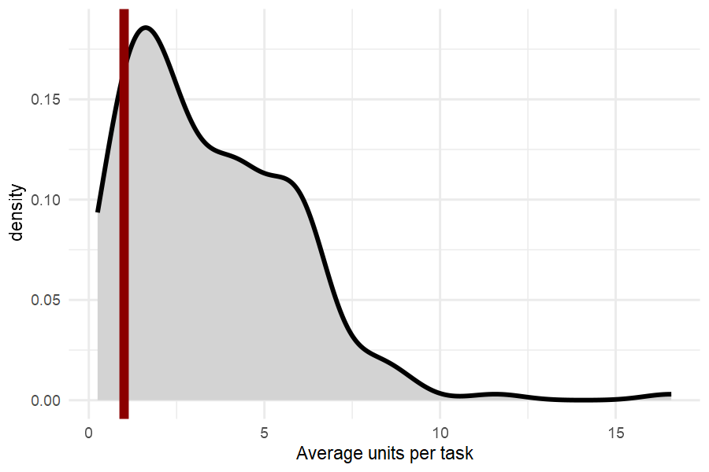


### Holdout

For hold-out validation, we keep 1 task per respondent. In v-fold cross-validation, this is done several times. However, each re-run of the model may take a while. For this example, we only use 1 set of holdout tasks. Hold-out evaluations results may vary slightly between publications that discuss this dataset.


```r
  #randomly assign hold-out group, use seed for reproducible plot
  set.seed(1.2335252) 
    pizza_ho_tasks=
    pizza %>%
      distinct(id,task) %>%
      mutate(id=as.integer(id))%>%
      group_by(id) %>%
      summarise(task=sample(task,1), .groups = "keep")
  set.seed(NULL)

  #calibration data
    pizza_cal= pizza %>% mutate(id=as.integer(id)) %>%
      anti_join(pizza_ho_tasks, by=c('id','task'))
    
  #'hold-out' data
    pizza_ho= pizza %>% mutate(id=as.integer(id)) %>%
      semi_join(pizza_ho_tasks, by=c('id','task'))
```


## Estimation

Estimate both models using *at least* 200,000 draws. Saving each 50th or 100th draw is sufficient. The `vd_est_vdm` fits the compensatory volumetric demand model, while `vd_est_vdm_screen` fits the model with attribute-based conjunctive screening. Using the `error_dist` argument, the type of error distribution can be specified. While [KHKA 2022](https://doi.org/10.1016/j.ijresmar.2022.04.001) assume Normal-distributed errors, here we assume Extreme Value Type 1 errors.


```r
  #compensatory
  out_pizza_cal = pizza_cal %>% vd_est_vdm(R=200000, keep=50, error_dist = "EV1")
  dir.create("draws")
  save(out_pizza_cal,file='draws/out_pizza_cal.rdata')

  #conjunctive screening
  out_pizza_screening_cal = pizza_cal %>% vd_est_vdm_screen(R=200000, keep=50, error_dist = "EV1")
  save(out_pizza_screening_cal,file='draws/out_pizza_screening_cal.rdata')
```


### Diagnostics

#### Quick check of convergence, or stationarity of the traceplots.

Compensatory:


```r
  out_pizza_cal %>% ec_trace_MU(burnin = 100)
```

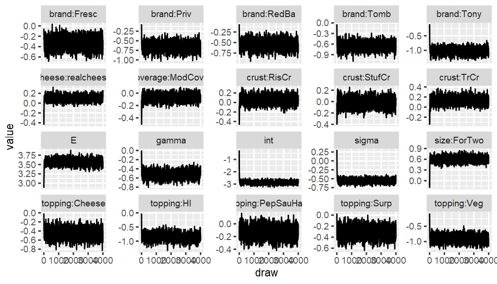

Conjunctive Screening:


```r
  out_pizza_screening_cal %>% ec_trace_MU(burnin = 100)
```

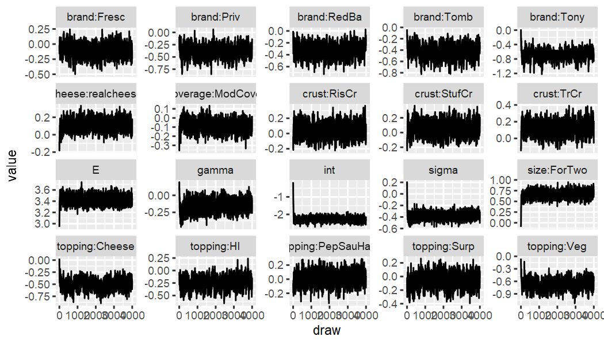


#### Distribution of Log-likehoods to check for outlier respondents:


```r
  vd_LL_vdm(out_pizza_cal ,pizza_cal, fromdraw = 3000) %>% 
    apply(1,mean) %>% tibble(LL=.) %>% 
    ggplot(aes(x=LL)) + 
      geom_density(fill="lightgrey", linewidth=1) + theme_minimal() +
      xlab("Individual average Log-Likelihood")
```

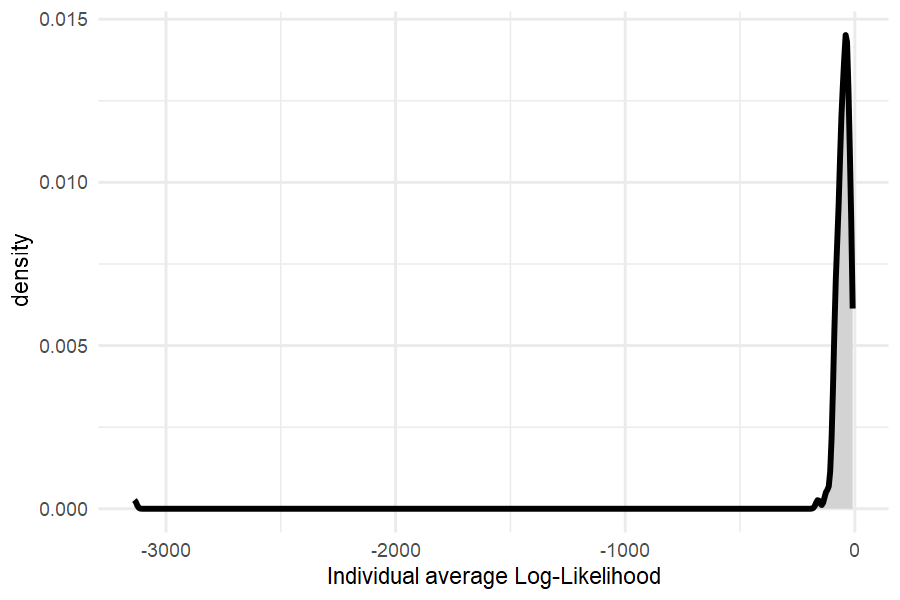

Here the left tail looks fine, and there do not appear to be extremely "bad" responders.


## Fit

### In-sample

First, we compare in-sample fit. The proposed model fits a lot better.


```r
  list(compensatory = out_pizza_cal,
       conjunctive  = out_pizza_screening_cal) %>%
    purrr::map_dfr(ec_lmd_NR, .id = 'model') %>%
    filter(part==1) %>% select(-part)
#> # A tibble: 2 × 2
#>   model           lmd
#>   <chr>         <dbl>
#> 1 compensatory -7889.
#> 2 conjunctive  -7401.
```


### Holdout

Now, we compare "holdout"-fit. First, posterior means of predictions are obtained via `vd_dem_summarise`, then the Mean Squared Error (MSE) and Mean Absolute Error (MAE) are computed and average across respondents. For illustration purposes, only one fold is used for holdout fit. Moreover, only 5000 draws and 5000 simulated error terms are used.


```r
  #generate predictions
  ho_dem_vd=
      pizza_ho %>%
        prep_newprediction(pizza_cal) %>%
          vd_dem_vdm(out_pizza_cal,
                      ec_gen_err_ev1(pizza_ho, out_pizza_cal, seed=101.1))
  
  ho_dem_vdscreen=
      pizza_ho %>%
        prep_newprediction(pizza_cal) %>%
          vd_dem_vdm_screen(out_pizza_screening_cal,
                            epsilon_not=ec_gen_err_ev1(pizza_ho, out_pizza_screening_cal, seed=101.1))
  
  #evaluate
  list(compensatory = ho_dem_vd,
       conjunctive  = ho_dem_vdscreen) %>%
        purrr::map_dfr(.%>%
          vd_dem_summarise() %>% dplyr::select(id:cheese, .pred=`E(demand)`) %>%
          mutate(pmMSE=(x-.pred)^2,
                 pmMAE=abs(x-.pred)) %>%
          summarise(MSE=mean(pmMSE),
                    MAE=mean(pmMAE)), 
        .id = 'model') -> holdout_fits
        
  holdout_fits
#> # A tibble: 2 × 3
#>   model          MSE   MAE
#>   <chr>        <dbl> <dbl>
#> 1 compensatory 0.669 0.418
#> 2 conjunctive  0.598 0.387
```


## Estimates

### Part-Worths

Using `ec_estimates_MU` it is easy to obtain the "upper level" posterior means of the key parameters.


```r
  out_pizza_cal %>% ec_estimates_MU()
#> # A tibble: 20 × 12
#>    attribute lvl        par                  mean     sd `CI-5%` `CI-95%` sig   model   error reference_lvl parameter 
#>    <chr>     <chr>      <chr>               <dbl>  <dbl>   <dbl>    <dbl> <lgl> <chr>   <chr> <chr>         <chr>     
#>  1 <NA>      <NA>       int               -2.87   0.143  -3.06    -2.67   TRUE  VD-comp EV1   <NA>          int       
#>  2 brand     Fresc      brand:Fresc       -0.331  0.100  -0.500   -0.166  TRUE  VD-comp EV1   DiGi          Fresc     
#>  3 brand     Priv       brand:Priv        -0.652  0.106  -0.823   -0.479  TRUE  VD-comp EV1   DiGi          Priv      
#>  4 brand     RedBa      brand:RedBa       -0.547  0.101  -0.715   -0.383  TRUE  VD-comp EV1   DiGi          RedBa     
#>  5 brand     Tomb       brand:Tomb        -0.651  0.104  -0.824   -0.482  TRUE  VD-comp EV1   DiGi          Tomb      
#>  6 brand     Tony       brand:Tony        -1.02   0.108  -1.20    -0.853  TRUE  VD-comp EV1   DiGi          Tony      
#>  7 size      ForTwo     size:ForTwo        0.602  0.0757  0.489    0.720  TRUE  VD-comp EV1   forOne        ForTwo    
#>  8 crust     RisCr      crust:RisCr        0.0555 0.0810 -0.0759   0.184  FALSE VD-comp EV1   Thin          RisCr     
#>  9 crust     StufCr     crust:StufCr      -0.0171 0.0790 -0.148    0.109  FALSE VD-comp EV1   Thin          StufCr    
#> 10 crust     TrCr       crust:TrCr         0.134  0.0706  0.0241   0.246  TRUE  VD-comp EV1   Thin          TrCr      
#> 11 topping   Cheese     topping:Cheese    -0.453  0.101  -0.621   -0.289  TRUE  VD-comp EV1   Pepperoni     Cheese    
#> 12 topping   HI         topping:HI        -0.851  0.121  -1.05    -0.656  TRUE  VD-comp EV1   Pepperoni     HI        
#> 13 topping   PepSauHam  topping:PepSauHam -0.128  0.0850 -0.271    0.0123 FALSE VD-comp EV1   Pepperoni     PepSauHam 
#> 14 topping   Surp       topping:Surp      -0.314  0.0931 -0.470   -0.159  TRUE  VD-comp EV1   Pepperoni     Surp      
#> 15 topping   Veg        topping:Veg       -0.900  0.109  -1.08    -0.731  TRUE  VD-comp EV1   Pepperoni     Veg       
#> 16 coverage  ModCover   coverage:ModCover -0.0727 0.0536 -0.156    0.0118 FALSE VD-comp EV1   densetop      ModCover  
#> 17 cheese    realcheese cheese:realcheese  0.100  0.0552  0.0167   0.186  TRUE  VD-comp EV1   NoInfo        realcheese
#> 18 <NA>      <NA>       sigma             -0.557  0.0637 -0.645   -0.468  TRUE  VD-comp EV1   <NA>          sigma     
#> 19 <NA>      <NA>       gamma             -0.525  0.0762 -0.646   -0.404  TRUE  VD-comp EV1   <NA>          gamma     
#> 20 <NA>      <NA>       E                  3.57   0.0788  3.44     3.69   TRUE  VD-comp EV1   <NA>          E
```


```r
  out_pizza_screening_cal %>% ec_estimates_MU()
#> # A tibble: 20 × 12
#>    attribute lvl        par                  mean     sd  `CI-5%` `CI-95%` sig   model      error reference_lvl parameter 
#>    <chr>     <chr>      <chr>               <dbl>  <dbl>    <dbl>    <dbl> <lgl> <chr>      <chr> <chr>         <chr>     
#>  1 <NA>      <NA>       int               -2.27   0.146  -2.47    -2.07    TRUE  VD-conj-pr EV1   <NA>          int       
#>  2 brand     Fresc      brand:Fresc       -0.0989 0.103  -0.266    0.0700  FALSE VD-conj-pr EV1   DiGi          Fresc     
#>  3 brand     Priv       brand:Priv        -0.381  0.116  -0.577   -0.197   TRUE  VD-conj-pr EV1   DiGi          Priv      
#>  4 brand     RedBa      brand:RedBa       -0.325  0.105  -0.501   -0.155   TRUE  VD-conj-pr EV1   DiGi          RedBa     
#>  5 brand     Tomb       brand:Tomb        -0.426  0.113  -0.619   -0.250   TRUE  VD-conj-pr EV1   DiGi          Tomb      
#>  6 brand     Tony       brand:Tony        -0.684  0.132  -0.904   -0.477   TRUE  VD-conj-pr EV1   DiGi          Tony      
#>  7 size      ForTwo     size:ForTwo        0.658  0.0834  0.533    0.785   TRUE  VD-conj-pr EV1   forOne        ForTwo    
#>  8 crust     RisCr      crust:RisCr        0.0475 0.0814 -0.0840   0.181   FALSE VD-conj-pr EV1   Thin          RisCr     
#>  9 crust     StufCr     crust:StufCr       0.0600 0.0850 -0.0839   0.196   FALSE VD-conj-pr EV1   Thin          StufCr    
#> 10 crust     TrCr       crust:TrCr         0.126  0.0745  0.00479  0.249   TRUE  VD-conj-pr EV1   Thin          TrCr      
#> 11 topping   Cheese     topping:Cheese    -0.508  0.103  -0.679   -0.341   TRUE  VD-conj-pr EV1   Pepperoni     Cheese    
#> 12 topping   HI         topping:HI        -0.244  0.115  -0.434   -0.0599  TRUE  VD-conj-pr EV1   Pepperoni     HI        
#> 13 topping   PepSauHam  topping:PepSauHam  0.0116 0.0910 -0.136    0.166   FALSE VD-conj-pr EV1   Pepperoni     PepSauHam 
#> 14 topping   Surp       topping:Surp      -0.0571 0.0964 -0.218    0.0996  FALSE VD-conj-pr EV1   Pepperoni     Surp      
#> 15 topping   Veg        topping:Veg       -0.668  0.120  -0.866   -0.479   TRUE  VD-conj-pr EV1   Pepperoni     Veg       
#> 16 coverage  ModCover   coverage:ModCover -0.0872 0.0575 -0.182    0.00412 FALSE VD-conj-pr EV1   densetop      ModCover  
#> 17 cheese    realcheese cheese:realcheese  0.115  0.0596  0.0193   0.212   TRUE  VD-conj-pr EV1   NoInfo        realcheese
#> 18 <NA>      <NA>       sigma             -0.378  0.0588 -0.468   -0.290   TRUE  VD-conj-pr EV1   <NA>          sigma     
#> 19 <NA>      <NA>       gamma             -0.153  0.0821 -0.292   -0.0204  TRUE  VD-conj-pr EV1   <NA>          gamma     
#> 20 <NA>      <NA>       E                  3.43   0.0716  3.31     3.55    TRUE  VD-conj-pr EV1   <NA>          E
```


### Screening probabilities

Using `ec_estimates_screen`, screening probabilities be obtained.


```r
  out_pizza_screening_cal %>% ec_estimates_screen()
#> # A tibble: 22 × 8
#>    attribute lvl        par                  mean     sd  `CI-5%` `CI-95%` limit
#>    <chr>     <chr>      <chr>               <dbl>  <dbl>    <dbl>    <dbl> <dbl>
#>  1 brand     DiGi       brand:DiGi        0.0205  0.0377 0.00166    0.0452    NA
#>  2 brand     Fresc      brand:Fresc       0.118   0.0423 0.0641     0.172     NA
#>  3 brand     Priv       brand:Priv        0.167   0.0478 0.0981     0.236     NA
#>  4 brand     RedBa      brand:RedBa       0.130   0.0437 0.0752     0.189     NA
#>  5 brand     Tomb       brand:Tomb        0.171   0.0494 0.100      0.239     NA
#>  6 brand     Tony       brand:Tony        0.269   0.0556 0.180      0.353     NA
#>  7 cheese    NoInfo     cheese:NoInfo     0.00854 0.0353 0.000366   0.0175    NA
#>  8 cheese    realcheese cheese:realcheese 0.00881 0.0354 0.000402   0.0187    NA
#>  9 coverage  ModCover   coverage:ModCover 0.00879 0.0353 0.000427   0.0180    NA
#> 10 coverage  densetop   coverage:densetop 0.0102  0.0356 0.000506   0.0229    NA
#> # … with 12 more rows
```

For a boxplot of screening parameters, use `ec_boxplot_screen`.


```r
  out_pizza_screening_cal %>% ec_boxplot_screen()
```

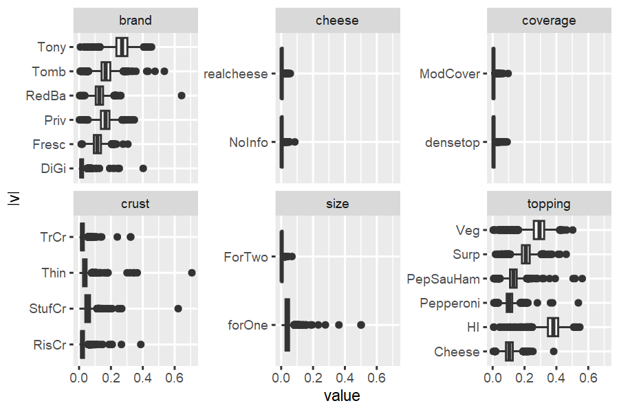


### Comparisons

Side-by-side part-worths of the volumetric demand models can be obtained by using `ec_estimates_MU` inside `purrr::map`.


```r
  list(compensatory=out_pizza_cal,
       conjunctive =out_pizza_screening_cal) %>%
        purrr::map_dfr(ec_estimates_MU, .id='model') %>% 
        dplyr::select(model, attribute, lvl, par, mean) %>%
        tidyr::pivot_wider(names_from = model, values_from = mean) 
#> # A tibble: 20 × 5
#>    attribute lvl        par               compensatory conjunctive
#>    <chr>     <chr>      <chr>                    <dbl>       <dbl>
#>  1 <NA>      <NA>       int                    -2.87       -2.27  
#>  2 brand     Fresc      brand:Fresc            -0.331      -0.0989
#>  3 brand     Priv       brand:Priv             -0.652      -0.381 
#>  4 brand     RedBa      brand:RedBa            -0.547      -0.325 
#>  5 brand     Tomb       brand:Tomb             -0.651      -0.426 
#>  6 brand     Tony       brand:Tony             -1.02       -0.684 
#>  7 size      ForTwo     size:ForTwo             0.602       0.658 
#>  8 crust     RisCr      crust:RisCr             0.0555      0.0475
#>  9 crust     StufCr     crust:StufCr           -0.0171      0.0600
#> 10 crust     TrCr       crust:TrCr              0.134       0.126 
#> 11 topping   Cheese     topping:Cheese         -0.453      -0.508 
#> 12 topping   HI         topping:HI             -0.851      -0.244 
#> 13 topping   PepSauHam  topping:PepSauHam      -0.128       0.0116
#> 14 topping   Surp       topping:Surp           -0.314      -0.0571
#> 15 topping   Veg        topping:Veg            -0.900      -0.668 
#> 16 coverage  ModCover   coverage:ModCover      -0.0727     -0.0872
#> 17 cheese    realcheese cheese:realcheese       0.100       0.115 
#> 18 <NA>      <NA>       sigma                  -0.557      -0.378 
#> 19 <NA>      <NA>       gamma                  -0.525      -0.153 
#> 20 <NA>      <NA>       E                       3.57        3.43
```

We can see that Hawaii topping and Tony brand receive higher average utilities in the screening model, because non-purchases of these Pizzas is explained by screening, not by the preference model.


```r
  list(compensatory=out_pizza_cal,
       conjunctive =out_pizza_screening_cal) %>%
        purrr::map_dfr(ec_estimates_MU,.id='model') %>% 
        dplyr::select(model, attribute, lvl, par, mean) %>%
        tidyr::pivot_wider(names_from = model, values_from = mean) %>%
          transmute(par, difference=conjunctive-compensatory) %>% arrange(desc(difference))
#> # A tibble: 20 × 2
#>    par               difference
#>    <chr>                  <dbl>
#>  1 topping:HI           0.606  
#>  2 int                  0.595  
#>  3 gamma                0.372  
#>  4 brand:Tony           0.334  
#>  5 brand:Priv           0.272  
#>  6 topping:Surp         0.257  
#>  7 topping:Veg          0.232  
#>  8 brand:Fresc          0.232  
#>  9 brand:Tomb           0.225  
#> 10 brand:RedBa          0.222  
#> 11 sigma                0.179  
#> 12 topping:PepSauHam    0.140  
#> 13 crust:StufCr         0.0771 
#> 14 size:ForTwo          0.0557 
#> 15 cheese:realcheese    0.0151 
#> 16 crust:TrCr          -0.00771
#> 17 crust:RisCr         -0.00800
#> 18 coverage:ModCover   -0.0145 
#> 19 topping:Cheese      -0.0545 
#> 20 E                   -0.134
```


## Demand Curves

Elasticities in volumetric demand models are not constant. To better understand implications of pricing decisions, demand curves can be a helpful tool.

The `ec_demcurve` function can be applied to all demand simulators. Based of an initial market scenario, it generates a series of scenarios where the price of a focal product is changed over an interval. It then runs the demand simulator several times, and we can use the output to draw a demand curve.

Pre-simulating error terms using `ec_gen_err_ev1` helps to smooth these demand curves. It generates one error term per draw for each of the alternatives and tasks in the corresponding design dataset.

### Define base case

We have to start by defining a `base case`, i.e. a scenario that we want to start with.


```r
  #define a set of offerings
  testm_pizza = 
  tibble(
    id=1L, task=1L, alt=1:6,
    brand   = c("DiGi", "Fresc", "Priv", "RedBa", "Tomb", "Tony"),
    size    = "forOne",
    crust   = "Thin",
    topping = "Veg",
    coverage= "ModCover",
    cheese  = "NoInfo",
    p       = c(3.5,3,2,2,2,1.5)) %>% 
  prep_newprediction(pizza)
  
  #for this experiment, offer this assortment to each of the respondents
  testmarket=
  tibble(
    id   = rep(seq_len(n_distinct(pizza$id)),each=nrow(testm_pizza)),
    task = 1,
    alt  = rep(1:nrow(testm_pizza),n_distinct(pizza$id))) %>% 
            bind_cols(
            testm_pizza[rep(1:nrow(testm_pizza),n_distinct(pizza$id)),-(1:3)])
```


### Demand curves

The output of `ec_demcurve` is a list, containing demand summaries for each product under the different price scenarios. The list can be stacked into a data.frame, which can be used to generate plots.


```r
  #Define focal brand for analysis
  focal_alternatives <- 
    testmarket %>% transmute(focal=brand=='Priv') %>% pull(focal)
  
  #pre-sim error terms
  eps_not <- testmarket %>% ec_gen_err_ev1(out_pizza_cal, 55667)
  
  #demand curve compensatory
  vd_demc_comp <-
    testmarket %>%
      ec_demcurve(focal_alternatives,
                  seq(0.5,1.5,,9),
                  vd_dem_vdm,
                  out_pizza_cal,
                  eps_not)
  
  #demand curve conjunctive screening
  vd_demc_screen <-
    testmarket %>%
      ec_demcurve(focal_alternatives,
                  seq(0.5,1.5,,9),
                  vd_dem_vdm_screen,
                  out_pizza_screening_cal,
                  eps_not)
  
  #combine demand curves from both models
  vd_outputs=rbind(
    vd_demc_comp   %>% do.call('rbind',.) %>% bind_cols(model='comp')     %>% bind_cols(demand='volumetric'),
    vd_demc_screen %>% do.call('rbind',.) %>% bind_cols(model='screenpr') %>% bind_cols(demand='volumetric'))

  #plot
  vd_outputs%>% 
  filter(brand=="Priv") %>%
    ggplot(aes(x=scenario, y=`E(demand)`, color=model)) + geom_line(size=2, alpha=.7) + 
      xlab("Price (as % of original)") + 
      scale_x_continuous(labels = scales::percent_format(), n.breaks = 5) +
      theme_minimal()
```

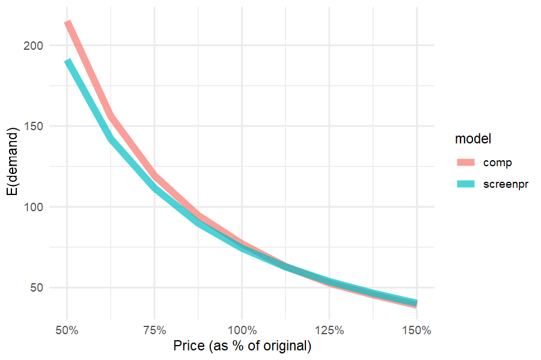


### Incidence curves

While demand curves look similar, incidence curves reveal that drastic price decreases lead to a smaller increase in people buying when accounting for screening:


```r
  #demand curve compensatory
  vd_demc_comp_inci =
    testmarket %>%
      ec_demcurve_inci(focal_alternatives,
                        seq(0.25,1.5,,9),
                        vd_dem_vdm,
                        out_pizza_cal,
                        eps_not)
  
  #demand curve conjunctive screening
  vd_demc_screen_inci =
    testmarket %>%
      ec_demcurve_inci(focal_alternatives,
                        seq(0.25,1.5,,9),
                        vd_dem_vdm_screen,
                        out_pizza_screening_cal,
                        eps_not)
  
  #combine demand curves from both models
  vd_outputs_inci=rbind(
    vd_demc_comp_inci %>% do.call('rbind',.) %>% bind_cols(model='comp') %>% bind_cols(demand='volumetric'),
    vd_demc_screen_inci %>% do.call('rbind',.) %>% bind_cols(model='screenpr') %>% bind_cols(demand='volumetric')) %>%
    mutate(`E(purchase)`=`E(demand)`)

  #plot
  vd_outputs_inci%>% 
  filter(brand=="Priv") %>%
    ggplot(aes(x=scenario, y=`E(purchase)`, color=model)) + geom_line(size=2, alpha=.7) + 
      xlab("Price (as % of original)") + 
      scale_x_continuous(labels = scales::percent_format(), n.breaks = 5) +
      theme_minimal()
```

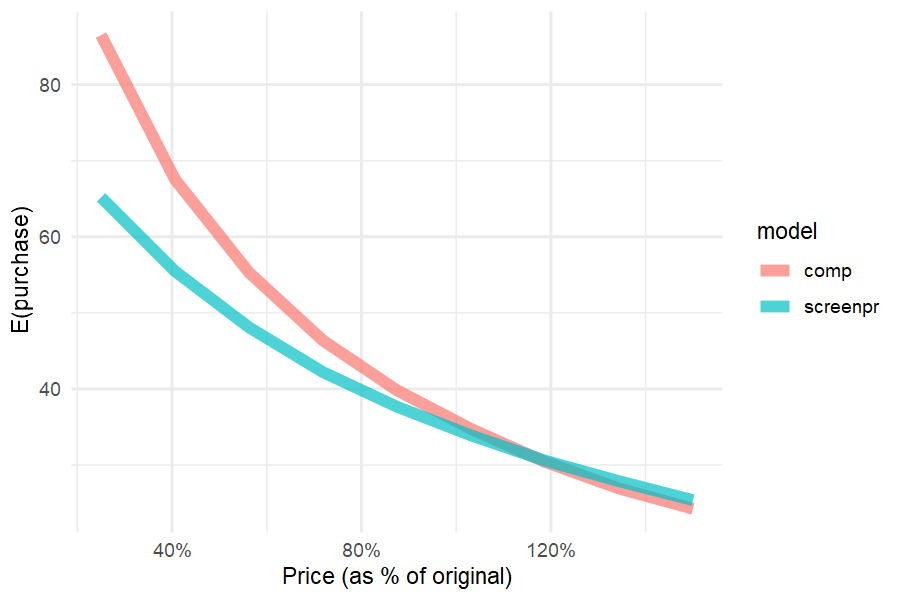


### Incidence curves for all brands

Generating the same plot for all major brands, we can see differences in incidence between the different models.


```r
  allbrands=names(table(testmarket$brand))
  
  demcout=list()
  
  for(kk in 1:6){
  demcout[[kk]]=
              ec_demcurve_inci(testmarket,
              testmarket$brand==allbrands[kk],
              c(.5,.6,.7,.8,.9,1),
              vd_dem_vdm_screen,
              out_pizza_screening_cal,
              ec_gen_err_ev1(testmarket,out_pizza_screening_cal,seed = 34543563))
  }
  
  demcout_vd=list()
  for(kk in 1:6){
  demcout_vd[[kk]]=
              ec_demcurve_inci(testmarket,
              testmarket$brand==allbrands[kk],
              c(.5,.6,.7,.8,.9,1),
              vd_dem_vdm,
              out_pizza_cal,
              ec_gen_err_ev1(testmarket,out_pizza_cal,seed = 34543563))
  }
  
  
  names(demcout)=allbrands
  names(demcout_vd)=allbrands
  
  demcurves_pizza=
  demcout %>% purrr::map_dfr(. %>% do.call('rbind',.),.id='focal') %>% 
    filter(focal==brand) %>% bind_cols(model='with screening') %>%
    bind_rows(
  demcout_vd %>% purrr::map_dfr(. %>% do.call('rbind',.),.id='focal') %>% 
    filter(focal==brand) %>% bind_cols(model='without screening'))
  

  demcurves_pizza %>% 
    mutate(model=factor(model,levels=c('without screening',"with screening"))) %>%
    ggplot(aes(x=scenario,y=`E(demand)`, linetype=model)) + 
      geom_line() + 
      facet_wrap(~focal, scales = 'free_y') + 
      xlab("Price (as % of original)") + ylab('Number of people buying') + 
      scale_x_continuous(labels = scales::percent_format(), n.breaks = 3) + theme_minimal()
```

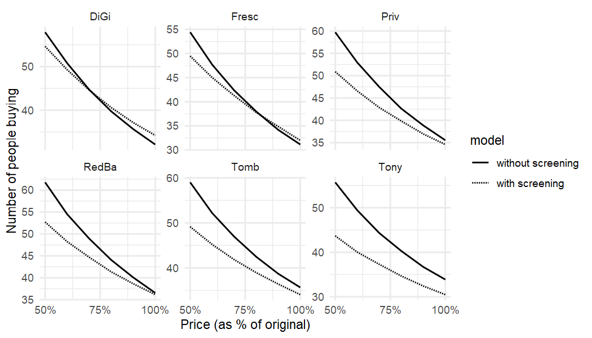


## The role of screening

### Frozen Pizza Consideration Set Size

To understand the pervasiveness of screening, we show the effective size of a consideration set, i.e. how many alternatives out of the 6 presented ones are actively evaluated by respondents. Unsurprisingly, it is a lot smaller than 6 for most.


```r
  vd_screenpr_n_screen=
    pizza_cal%>%
      ec_screenprob_sr(out_pizza_screening_cal) %>%
      group_by(id, task)  %>%
        summarise(.screendraws=list(purrr::reduce(.screendraws ,`+`)), .groups = "keep") %>%
        ec_screen_summarise %>%
        group_by(id) %>%
          summarise(n_screen=mean(`E(screening)`))
  
  vd_screenpr_n_screen %>% 
    mutate(`Average size of consideration set`= 6-n_screen) %>%
    ggplot(aes(x=`Average size of consideration set`)) + 
      geom_density(fill="lightgrey", linewidth=1) + 
      geom_vline(xintercept=6, linewidth=1.5, color="black") + theme_minimal()
```

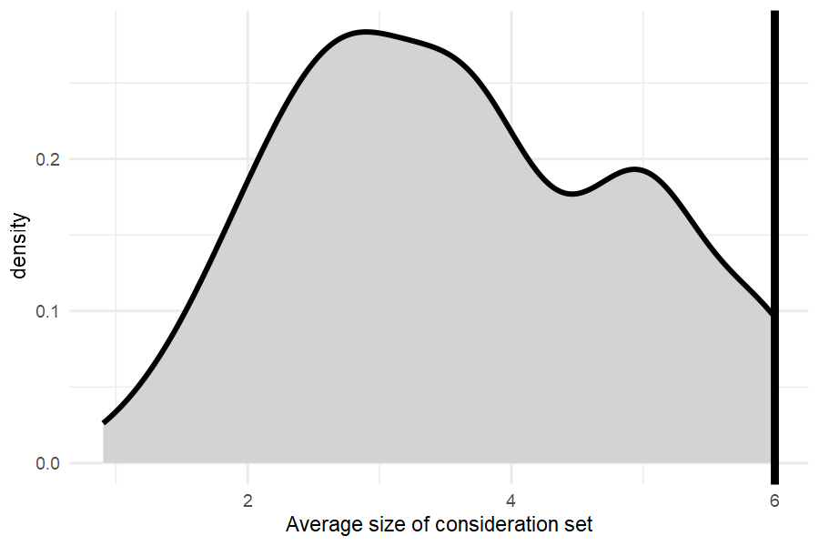


### Predicting zero demand - Screening vs Preference

To further illustrate the relevance ofs creening, we can see how most of Tony's non-buyeers simply do not even consider the brand.


```r
  #predict demand for base case
  sim1_dem_vdscreen=
    testm_pizza %>%
        vd_dem_vdm_screen(out_pizza_screening_cal)
  
  #(no-)buy probability
  sim1_nobuy_vdsrpr=
    sim1_dem_vdscreen %>%
        mutate(draws=purrr::map(.demdraws,sign)) %>%
        mutate(buyprob=purrr::map_dbl(.demdraws,mean)) %>%
          group_by(brand) %>%
            summarise(nobuy=1-mean(buyprob))
  
  #screening probability
  sim1_screen_vdsrpr=
  testmarket %>%
    ec_screenprob_sr(out_pizza_screening_cal) %>%
    ec_screen_summarise %>% dplyr::select(-.screendraws) %>%
    group_by(brand) %>%
      summarise(screening=mean(`E(screening)`))
  
  #create stacked plot
  sim1_screen_vdsrpr %>% 
    left_join(sim1_nobuy_vdsrpr) %>% 
      mutate(`no preference`=nobuy-screening) %>% 
       dplyr::select(brand,screening,`no preference`) %>% 
       tidyr::pivot_longer(2:3,values_to = 'share', names_to = 'Explanation') %>%
        mutate(`Alternative`=brand, `Share of 0-demand`=share) %>%
        ggplot(aes(x=Alternative,y=`Share of 0-demand`,fill=Explanation)) + 
         geom_bar(stat='identity') +
         scale_fill_grey(start=.7, end=.4, breaks=c('screening','no preference')) +     
         geom_text(aes(label = sprintf("%1.0f%%", 100*share)), 
                        size = 4, hjust = 0.5, vjust = 0, 
                   position = position_stack(vjust = 0.5)) +
         scale_y_continuous(labels = scales::percent_format()) + theme_minimal() 
```

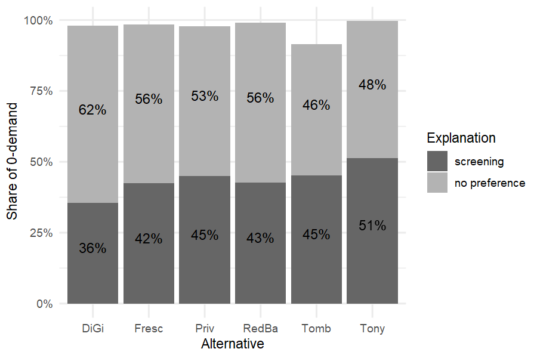


### Relationship between screening and preference

We find that respondents with high screening probabilities tend to have $\beta_{veg}$ close to the mode, indicating that individual-level information about preferences is not available when screening is present. More extreme estimates of $\beta_{veg}$ occur when screening is not present. Thus, non-purchase is not rationalized as screening when there exists sufficient individual-level information to estimate preference.


```r
  scatterpl<-
    tibble(id=seq_along(unique(pizza$id)), 
           beta = out_pizza_screening_cal$thetaDraw[15,,] %>% apply(1,mean),
           tau  = out_pizza_screening_cal$tauDraw[18,,]   %>% apply(1,mean)) %>%
      ggplot(aes(x=beta, y=tau)) + 
        geom_point(alpha=.3) + theme_minimal()
  
  scatterplplus<-ggExtra::ggMarginal(scatterpl, type = "histogram")
  print(scatterplplus)
```

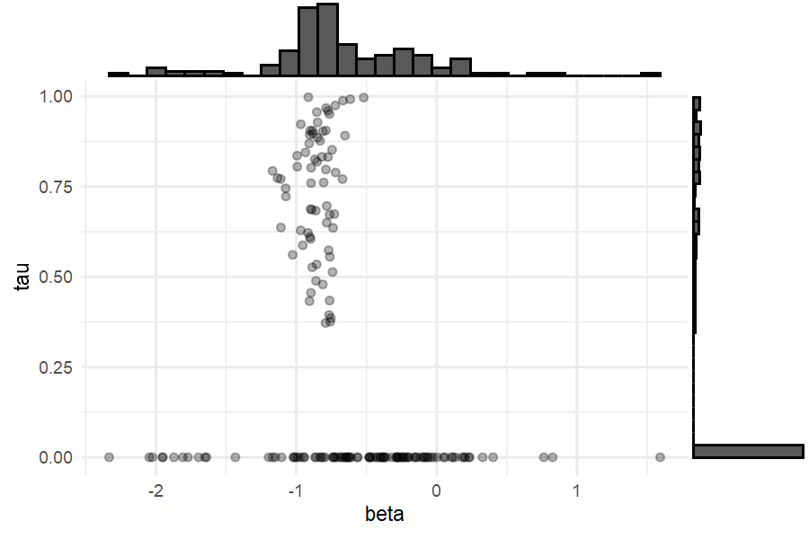
